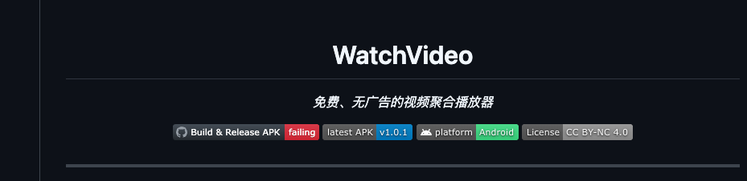

# dwy-ai-experience



> Personal AI engineering repository by dwy, focused on tooling, scaffolding, rules sync, and release automation.

[中文](./README.md)

## Overview

`dwy-ai-experience` is a monorepo built around AI development workflows. It currently brings together three major areas:

- `claude-cli`: scaffolding, rule templates, and Claude/Codex sync entrypoint
- `frontend/*`: UI libraries, utility libraries, and playground
- `backend`: FastAPI backend foundation and service templates

## Highlights

- Unified project bootstrap, rules distribution, skill sync, and hooks sync
- Supports both Claude and Codex local collaboration setup
- npm / PyPI release flow standardized through GitHub Actions OIDC
- Shared engineering rules for mobile full-screen adaptation, icon libraries, and code annotation

## Claude CLI

`claude-cli` is the core module in this repository. It does more than scaffolding: it turns team conventions into executable tooling.

### Core Commands

- `dwy create <project-name>`
  - Generate a standard project template
- `dwy sync`
  - Sync selected shared conventions into the current project
- `dwy claude sync`
  - Sync skills, rules, commands, and hooks into project `.claude/`
- `dwy claude sync md`
  - Sync repository `CLAUDE.md` into the global configuration
- `dwy codex sync`
  - Convert Claude templates and sync them into `.agents/`, `.codex/hooks/`, and `AGENTS.md`

### What It Solves

- Bootstraps new projects with a standard structure and base engineering setup
- Eliminates manual copy-paste for team conventions
- Keeps Claude Code and Codex project-level configuration in sync
- Pushes release flow toward auditable GitHub Actions automation

## Repository Structure

- `/claude-cli`
  - `create-dwy` CLI, sync logic, templates, and rule sources
- `/frontend/eui`
  - Vue component library
- `/frontend/ekit`
  - Vue utility library
- `/frontend/playground`
  - Component playground and docs site
- `/backend`
  - FastAPI infrastructure and backend templates

## Quick Start

### Install CLI Dependencies

```bash
cd claude-cli
pnpm install
```

### Create And Sync

```bash
npx create-dwy your-project

dwy sync
dwy claude sync
dwy codex sync
```

## Development

```bash
cd frontend/eui && pnpm install && pnpm build
cd frontend/ekit && pnpm install && pnpm build
cd backend && uv sync
```

## Release

### CLI

- Tag format: `create-dwy@x.y.z`
- Pipeline: GitHub Actions + OIDC
- Result: npm publish and GitHub Release created automatically

### Libraries

- `eui` and `ekit` follow a unified build and release workflow

## Contributing

- Follow repository conventions in [`AGENTS.md`](./AGENTS.md)
- Keep cross-package changes scoped and explicit
- If you update shared templates or rules, sync `claude-cli/templates/` as well

## License

MIT
