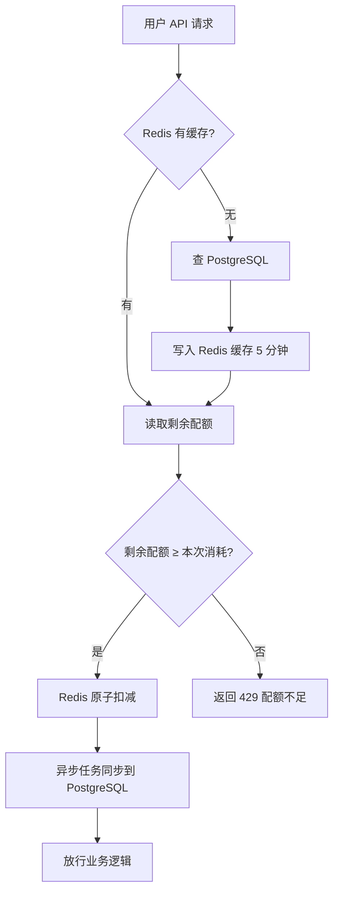

# 配额计算

**更新时间**: 2026-05-17

## 1. 概述

用户每次调用数据查询 API(如查因子、查 Tick)时,系统都会先检查这个用户的剩余配额够不够。
够 → 扣掉本次消耗,放行业务逻辑;不够 → 返回 429 错误,告诉用户超限。
配额按月重置,套餐升级立即生效新配额。整个判断走 Redis 缓存,保证高并发下不卡顿。

## 2. 实现逻辑

### 2.1 流程图

### 2.2 关键步骤

1. **读取配额**: 先查 Redis,5 分钟没人查就过期。为什么用 Redis: 配额查询是高频操作,直接打 DB 扛不住。
2. **原子扣减**: 用 Redis 的 `DECRBY` 指令保证并发安全。为什么不用 DB 行锁: Redis 内存操作快几十倍,而且并发请求多时行锁会排队。
3. **异步落盘**: Redis 扣减成功后,丢一个异步任务把最新值同步回 PostgreSQL。为什么异步: 接口响应不能等 DB 写完,异步保证用户体验。
4. **月度重置**: 每月 1 日 0 点定时任务把所有用户的"已用配额"清零。为什么定时: 套餐周期是按月计的,统一时间点重置便于对账。
5. **套餐升级**: 用户升级套餐时,服务会主动清除该用户的 Redis 缓存,下次请求会从 DB 重新拉取新配额上限。

## 3. 关键配置

| 配置项 | 默认值 | 说明 | 位置 |
|--------|--------|------|------|
| Redis 缓存 TTL | 300 秒 | 配额数据在 Redis 里保留多久 | `quant_billing/quota.py:23` |
| 月度重置时间 | 每月 1 日 00:00 | Cron 表达式 `0 0 1 * *` | `quant_billing/tasks/reset.py:8` |
| 套餐配额表名 | `plan_quotas` | PostgreSQL 表,存每个套餐对应的月度配额 | `quant_billing/models.py:45` |
| 异步落盘队列 | `quota_sync` | ARQ 队列名,负责同步 Redis → PostgreSQL | `quant_billing/worker.py:12` |
| 超限返回码 | 429 | 配额不足时返回的 HTTP 状态码 | `quant_billing/quota.py:67` |

## 4. 依赖关系

- **PostgreSQL**: 读写 `quotas` 表(每个用户的当月已用量)和 `plan_quotas` 表(每个套餐的配额上限)
- **Redis**: 缓存 + 原子扣减,key 格式 `quant:quota:{user_id}`,TTL 5 分钟
- **ARQ (异步任务框架)**: `quota_sync` 队列负责把 Redis 的扣减结果异步同步回 PostgreSQL,接口不等待
- **dwyeapi 框架**: 走统一异常体系,配额不足时抛 `BusinessError(code="QUOTA_EXCEEDED")`,前端按 code 显示提示
- **不依赖**: DolphinDB、MinIO、外部支付接口
