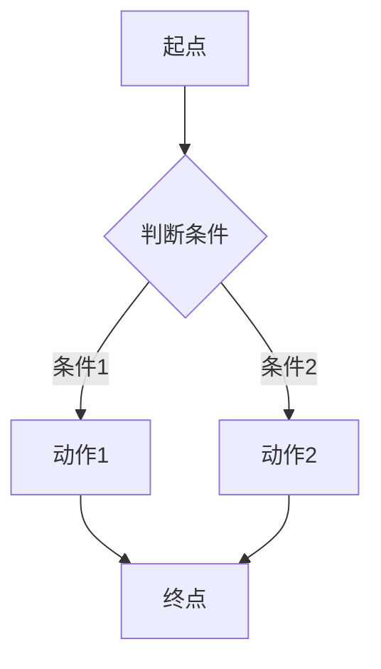

# {{逻辑标题}}

**更新时间**: {{YYYY-MM-DD}}

## 1. 概述

{{1 段, 3-5 句。讲清楚"这段代码是做什么的、解决什么问题、什么时候被触发"。
面向非 IT 读者,避免行话。}}

## 2. 实现逻辑

### 2.1 流程图

### 2.2 关键步骤

1. **步骤名一**: 做什么 / 为什么这么做
2. **步骤名二**: 做什么 / 为什么这么做
3. **步骤名三**: 做什么 / 为什么这么做

## 3. 关键配置

| 配置项 | 默认值 | 说明 | 位置 |
|--------|--------|------|------|
| {{配置项名}} | {{默认值}} | {{用途说明}} | `{{相对路径:行号}}` |

## 4. 依赖关系

- **{{依赖名}}**: {{用途, 涉及的 key/表/接口}}
- **{{依赖名}}**: {{用途, 涉及的 key/表/接口}}
- **不依赖**: {{明确列出常见但不涉及的组件,如 DolphinDB / MinIO / 外部 API}}
